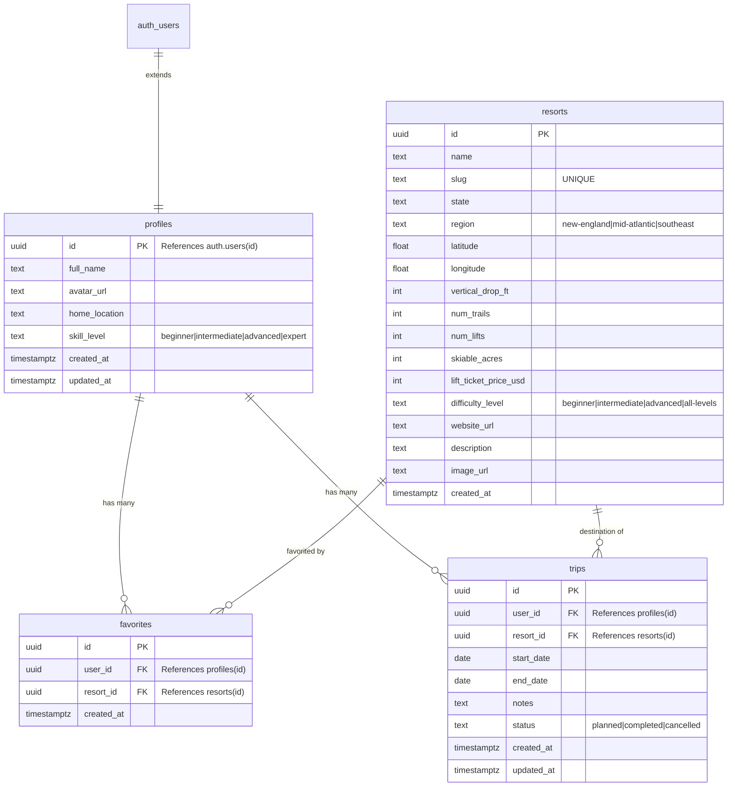

# Database Documentation — SkiTrip AI

## Overview

SkiTrip AI uses Supabase (PostgreSQL) with four tables. All schema changes are managed via SQL files run in the Supabase Dashboard SQL Editor.

**Schema file**: `supabase/schema.sql`

## How to Apply Schema Changes

1. Open [Supabase Dashboard](https://supabase.com/dashboard)
2. Select your project
3. Navigate to **SQL Editor** → **New Query**
4. Paste the contents of `supabase/schema.sql`
5. Click **Run**
6. For seed data, run `supabase/seed.sql` separately after the schema

---

## Entity Relationship Diagram

---

## Tables

### `profiles`

Extends `auth.users` with application-specific fields. Auto-created via trigger on user signup.

| Column | Type | Constraints | Description |
|--------|------|-------------|-------------|
| `id` | UUID | PK, FK → auth.users(id), CASCADE | Matches the Supabase auth user ID |
| `full_name` | TEXT | nullable | User's display name |
| `avatar_url` | TEXT | nullable | Profile picture URL |
| `home_location` | TEXT | nullable | Home city (e.g., "Baltimore, MD") for distance calculations |
| `skill_level` | TEXT | CHECK: beginner/intermediate/advanced/expert | Self-reported skiing ability |
| `created_at` | TIMESTAMPTZ | DEFAULT NOW() | |
| `updated_at` | TIMESTAMPTZ | DEFAULT NOW(), auto-updated via trigger | |

### `resorts`

Static resort data. Managed via Supabase dashboard or SQL inserts. Not user-editable.

| Column | Type | Constraints | Description |
|--------|------|-------------|-------------|
| `id` | UUID | PK, DEFAULT gen_random_uuid() | |
| `name` | TEXT | NOT NULL | Resort display name |
| `slug` | TEXT | UNIQUE, NOT NULL | URL-friendly identifier |
| `state` | TEXT | NOT NULL | Two-letter state code (e.g., "VT") |
| `region` | TEXT | NOT NULL, CHECK: new-england/mid-atlantic/southeast | Geographic region |
| `latitude` | DOUBLE PRECISION | NOT NULL | For weather API and map |
| `longitude` | DOUBLE PRECISION | NOT NULL | For weather API and map |
| `vertical_drop_ft` | INTEGER | nullable | Vertical drop in feet |
| `num_trails` | INTEGER | nullable | Total trail count |
| `num_lifts` | INTEGER | nullable | Total lift count |
| `skiable_acres` | INTEGER | nullable | Skiable terrain |
| `lift_ticket_price_usd` | INTEGER | nullable | Weekend adult ticket price |
| `difficulty_level` | TEXT | CHECK: beginner/intermediate/advanced/all-levels | Primary difficulty |
| `website_url` | TEXT | nullable | Official resort website |
| `description` | TEXT | nullable | Short description |
| `image_url` | TEXT | nullable | Resort hero image |
| `created_at` | TIMESTAMPTZ | DEFAULT NOW() | |

### `favorites`

Join table linking users to their favorite resorts.

| Column | Type | Constraints | Description |
|--------|------|-------------|-------------|
| `id` | UUID | PK, DEFAULT gen_random_uuid() | |
| `user_id` | UUID | FK → profiles(id), CASCADE, NOT NULL | |
| `resort_id` | UUID | FK → resorts(id), CASCADE, NOT NULL | |
| `created_at` | TIMESTAMPTZ | DEFAULT NOW() | |

**Unique constraint**: `(user_id, resort_id)` — prevents duplicate favorites.

### `trips`

User-created trip plans.

| Column | Type | Constraints | Description |
|--------|------|-------------|-------------|
| `id` | UUID | PK, DEFAULT gen_random_uuid() | |
| `user_id` | UUID | FK → profiles(id), CASCADE, NOT NULL | |
| `resort_id` | UUID | FK → resorts(id), CASCADE, NOT NULL | |
| `start_date` | DATE | NOT NULL | Trip start |
| `end_date` | DATE | NOT NULL | Trip end |
| `notes` | TEXT | nullable | User notes |
| `status` | TEXT | DEFAULT 'planned', CHECK: planned/completed/cancelled | |
| `created_at` | TIMESTAMPTZ | DEFAULT NOW() | |
| `updated_at` | TIMESTAMPTZ | DEFAULT NOW(), auto-updated via trigger | |

---

## Indexes

| Index | Table | Column(s) | Purpose |
|-------|-------|-----------|---------|
| `idx_favorites_user_id` | favorites | user_id | Fast lookup of user's favorites |
| `idx_favorites_resort_id` | favorites | resort_id | Fast lookup of resort's favoriters |
| `idx_trips_user_id` | trips | user_id | Fast lookup of user's trips |
| `idx_trips_resort_id` | trips | resort_id | Fast lookup of trips to a resort |
| `idx_resorts_region` | resorts | region | Filter by region |
| `idx_resorts_slug` | resorts | slug | Lookup by slug (detail pages) |
| `idx_resorts_price` | resorts | lift_ticket_price_usd | Filter/sort by price |

---

## Row Level Security (RLS) Policies

All tables have RLS enabled. Policies use `auth.uid()` to scope data access.

### `profiles`

| Policy | Operation | Rule |
|--------|-----------|------|
| Users can view own profile | SELECT | `auth.uid() = id` |
| Users can update own profile | UPDATE | `auth.uid() = id` |
| Users can insert own profile | INSERT | `auth.uid() = id` |

### `resorts`

| Policy | Operation | Rule |
|--------|-----------|------|
| Anyone can view resorts | SELECT | `true` (public data) |

### `favorites`

| Policy | Operation | Rule |
|--------|-----------|------|
| Users can view own favorites | SELECT | `auth.uid() = user_id` |
| Users can add favorites | INSERT | `auth.uid() = user_id` |
| Users can remove favorites | DELETE | `auth.uid() = user_id` |

### `trips`

| Policy | Operation | Rule |
|--------|-----------|------|
| Users can view own trips | SELECT | `auth.uid() = user_id` |
| Users can create trips | INSERT | `auth.uid() = user_id` |
| Users can update own trips | UPDATE | `auth.uid() = user_id` |
| Users can delete own trips | DELETE | `auth.uid() = user_id` |

---

## Triggers

### `on_auth_user_created`

**Fires**: After INSERT on `auth.users`
**Action**: Creates a row in `profiles` with the new user's ID, extracting `full_name` and `avatar_url` from `raw_user_meta_data` if available.

### `profiles_updated_at` / `trips_updated_at`

**Fires**: Before UPDATE on `profiles` / `trips`
**Action**: Sets `updated_at` to `NOW()`.

---

## Seed Data

The MVP includes 25 East Coast ski resorts across three regions:

| Region | Count | States |
|--------|-------|--------|
| New England | 15 | VT (8), NH (4), ME (2), NH (1) |
| Mid-Atlantic | 7 | NY (4), PA (3) |
| Southeast | 3 | WV (1), VA (2) |

Price range: $65 (Elk Mountain) to $179 (Stowe).

See `supabase/seed.sql` for the full INSERT statement.
